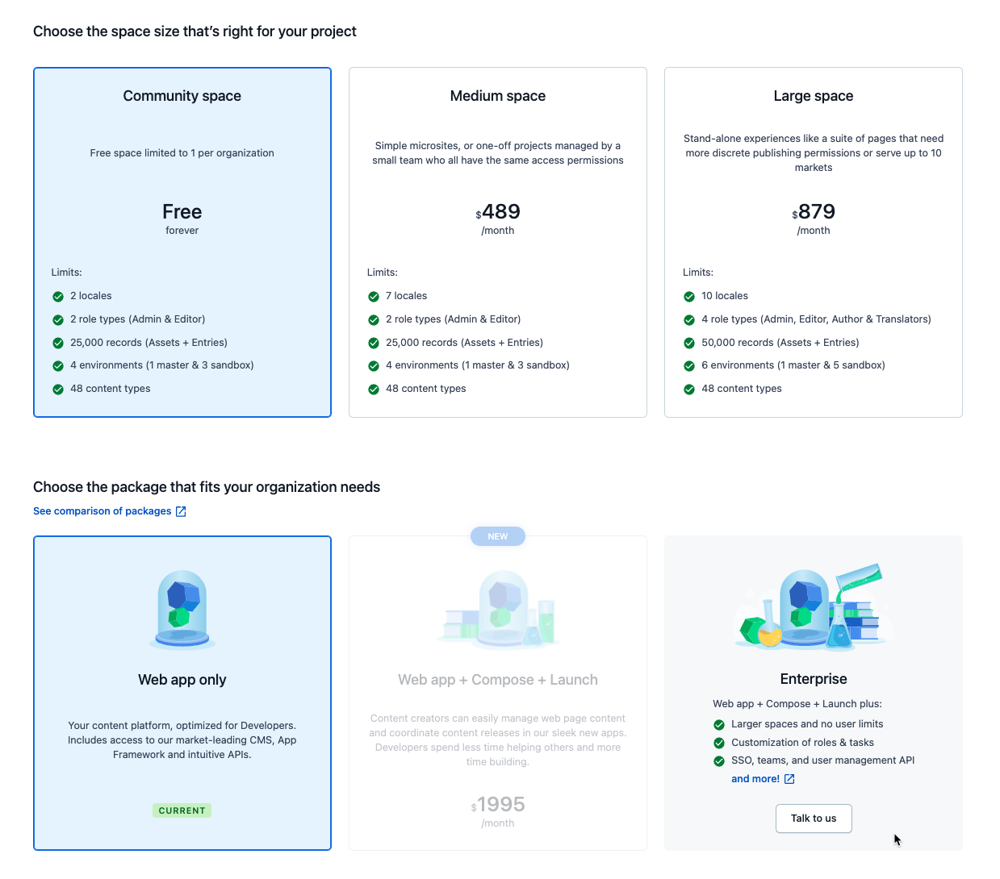
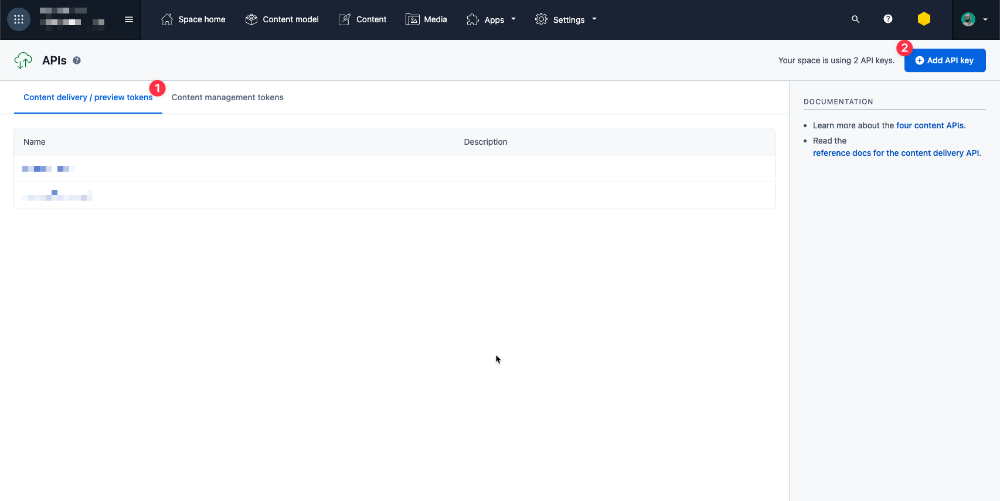
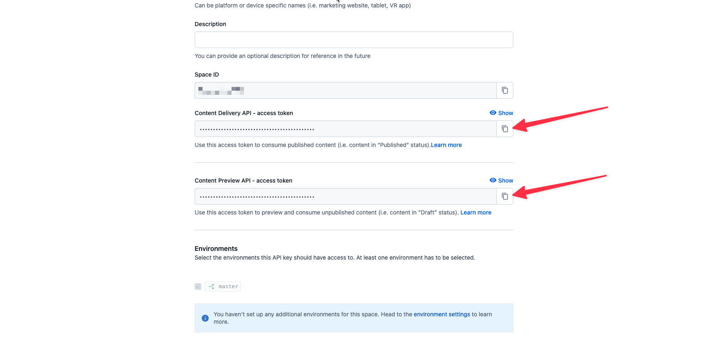

# Adding Stackbit to a Next.js + Contentful Site

**ℹ️ This project is used as a starting point for [our Contentful tutorial](https://docs.stackbit.com/integrations/contentful). If you would like to create a new project with Contentful as the content source, please use [the Contentful starter](https://github.com/stackbit-themes/contentful-starter).**

The code here contains what could be reasonably borrowed from [the official Next.js + Contentful example](https://github.com/vercel/next.js/tree/canary/examples/cms-contentful). Changes made were to enhance the Stackbit integration guide.

## Prerequisites

Before you begin, please make sure you have the following:

- Contentful account
- Node v14 or later

## Setup Instructions

The following sections take you through the process of getting this project set up and wired up to Contentful so you can begin the tutorial.

### Create New Project

Use the `create-stackbit-app` command to create a new project:

```txt
npx create-stackbit-app@latest --example tutorial-contentful
```

This will create a new instance of this project in a `tutorial-contentful` directory.

### Create Contentful Space

After signing into Contentful, create a new community (free) space. Note that if you already have an active Contentful account, you may want to [create an organization](https://app.contentful.com/account/organizations/new) to place your new space.

When you're within an organization, you can create a new community space with the web app package.



### Generate Management Token

If you don't already have a management token (or _personal access token_), you can generate one. To do so, go into your new empty space, then:

1. Click Settings
1. Chose API Keys
1. Select the Content management tokens tab
1. Click the button to generate a new token


**⚠️ Take care to store this token as necessary. You will not be able to view again within Contentful.**

### Import Content

Your new project already contains the content for the tutorial. You can import this into Contentful by running the setup command.

```txt
cd tutorial-contentful
npx cross-env CONTENTFUL_SPACE_ID={...} CONTENTFUL_MANAGEMENT_TOKEN={...} npm run setup
```

Replace the `{...}` with the appropriate values:

- Space ID can be found in the URL when inside a space.
- Management token is the token you just created (or referenced).

### Generate API Keys

From the same place you generated the management token, you can now generate API access keys.

1. Select the content delivery / preview tokens
1. Choose Add API key



### Set Environment Variables

In your project, duplicate `.env.local.example` to `.env.local`. Fill in the values:

```txt
CONTENTFUL_SPACE_ID="..."
CONTENTFUL_ACCESS_TOKEN="..."
CONTENTFUL_PREVIEW_ACCESS_TOKEN="..."
CONTENTFUL_PREVIEW_SECRET="..."
```

The API keys (both delivery and preview) can be copied from the API screen you see after creating a new key.



Note that the `CONTENTFUL_PREVIEW_SECRET` can be any string.

### Run the Project

Now you should be able to run the Next.js development server and see your content.

```txt
npm run dev
```

Visit localhost:3000 and you should see the example content you imported into your new Contentful space.

## Support

If you get stuck along the way, [drop into our Discord server](https://discord.gg/HUNhjVkznH) and send a message in the `#documentation` or `#help` channels.
